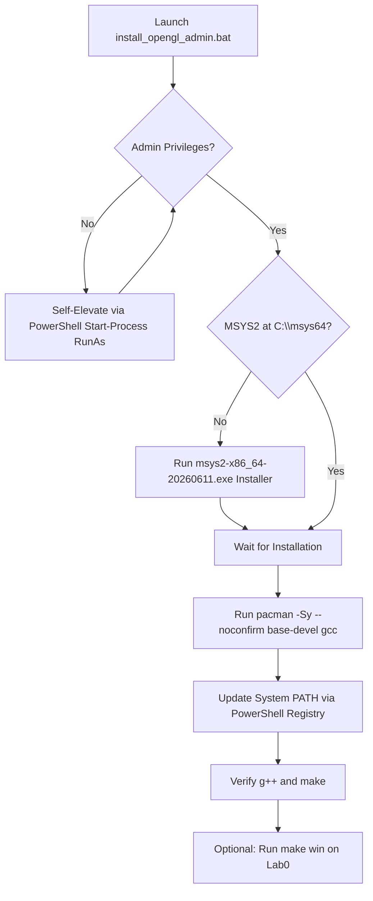

# Modern OpenGL (GLFW + GLAD + MinGW/MSYS2) Complete Setup & Technical Guide

A consolidated technical reference for configuring, building, and troubleshooting Modern OpenGL (v3.3 Core Profile) on Windows using MSYS2, MinGW-w64, GLFW, and GLAD.

---

## 1. Setting Up Modern OpenGL (GLFW & GLAD)

### Overview
Modern OpenGL (v3.3 Core Profile and higher) decouples windowing/context creation from function pointer loading:
1. **GLFW**: A lightweight cross-platform library for creating windows, OpenGL contexts, and receiving input events.
2. **GLAD**: An OpenGL Extension Wrangler library generated based on official Khronos XML specifications to dynamically load OpenGL function pointers at runtime.

### Key Initialization Sequence
```cpp
#include "glad.h"
#include "glfw3.h"
#include <iostream>

int main() {
    // 1. Initialize GLFW
    glfwInit();
    glfwWindowHint(GLFW_CONTEXT_VERSION_MAJOR, 3);
    glfwWindowHint(GLFW_CONTEXT_VERSION_MINOR, 3);
    glfwWindowHint(GLFW_OPENGL_PROFILE, GLFW_OPENGL_CORE_PROFILE);

    // 2. Create Window
    GLFWwindow* window = glfwCreateWindow(800, 600, "OpenGL Window", NULL, NULL);
    if (!window) {
        glfwTerminate();
        return -1;
    }
    glfwMakeContextCurrent(window);

    // 3. Initialize GLAD Function Loader
    if (!gladLoadGLLoader((GLADloadproc)glfwGetProcAddress)) {
        std::cout << "Failed to initialize GLAD" << std::endl;
        return -1;
    }

    return 0;
}
```

---

## 2. MSYS2 GCC & Make PATH Environment Configuration

### Pacman Package Setup
Inside MSYS2, install the C++ compiler suite and build utilities:
```bash
pacman -Sy --noconfirm base-devel gcc
```
- `base-devel`: Installs `make.exe`, `bison`, `flex`, `patch`, and core build utilities.
- `gcc`: Installs `g++.exe`, `gcc.exe`, and MinGW runtime headers.

### System PATH Environment Registration
To use `g++.exe` and `make.exe` in Windows CMD or PowerShell, register these paths in System Environment Variables:
- `C:\msys64\usr\bin` (Contains `make.exe` and bash utilities)
- `C:\msys64\mingw64\bin` (Contains `g++.exe` and 64-bit GCC toolchain)

#### PowerShell Automated Registry Script
```powershell
$sysPath = [System.Environment]::GetEnvironmentVariable('Path', 'Machine');
$usrBin = 'C:\msys64\usr\bin';
$mingwBin = 'C:\msys64\mingw64\bin';
if (-not ($sysPath -split ';' -contains $usrBin)) { $sysPath = $usrBin + ';' + $sysPath };
if (-not ($sysPath -split ';' -contains $mingwBin)) { $sysPath = $mingwBin + ';' + $sysPath };
[System.Environment]::SetEnvironmentVariable('Path', $sysPath, 'Machine');
```

---

## 3. KHR platform.h & GLAD Header Include Fixes

### Problem
Compiling GLAD files may emit:
```text
fatal error: KHR/khrplatform.h: No such file or directory
 #include <KHR/khrplatform.h>
```

### Technical Solution
GLAD generators expect `khrplatform.h` inside a `KHR/` subdirectory. In flat project layouts:
1. Ensure `khrplatform.h` exists in your `include/` directory.
2. Edit `include/glad.h` and update line `#include <KHR/khrplatform.h>` to relative include `#include "khrplatform.h"`.

---

## 4. Makefile Automation & Build Systems

### Windows Target (`make win`)
```makefile
win:
	g++.exe -fdiagnostics-color=always -I./include ./src/main.cpp ./src/glad.c -o ./build/main.exe -Llib -lglfw3 -lopengl32 -lgdi32
	./build/main.exe
```
- `-I./include`: Adds header directory for `glad.h`, `glfw3.h`, `khrplatform.h`.
- `./src/glad.c`: Compiles GLAD loader alongside `main.cpp`.
- `-Llib -lglfw3`: Links 64-bit GLFW library (`glfw3.dll` / `libglfw3.a`).
- `-lopengl32 -lgdi32`: Links native Windows OpenGL and GDI libraries.

### Linux Target (`make linux`)
```makefile
linux:
	g++ -fdiagnostics-color=always -I./include ./src/main.cpp ./src/glad.c -o ./build/main -Llib -lglfw -lGL -lXrandr -lX11 -lrt -ldl
	./build/main
```

---

## 5. 1-Click Automated Batch Script Architecture

`install_opengl_admin.bat` automates environment setup:



---

## 6. Troubleshooting & Diagnostics

| Symptom | Root Cause | Solution |
|---|---|---|
| `Failed to create GLFW window` | GPU driver doesn't support OpenGL 3.3 | Check OpenGL version with **GLView**; update GPU display drivers |
| `glfw3.dll not found` | Dynamic DLL missing from execution folder | Copy `glfw3.dll` from `lib/` into `./build/` |
| `'g++' not recognized` | PATH environment variable not refreshed | Restart CMD/VS Code to reload System PATH |
